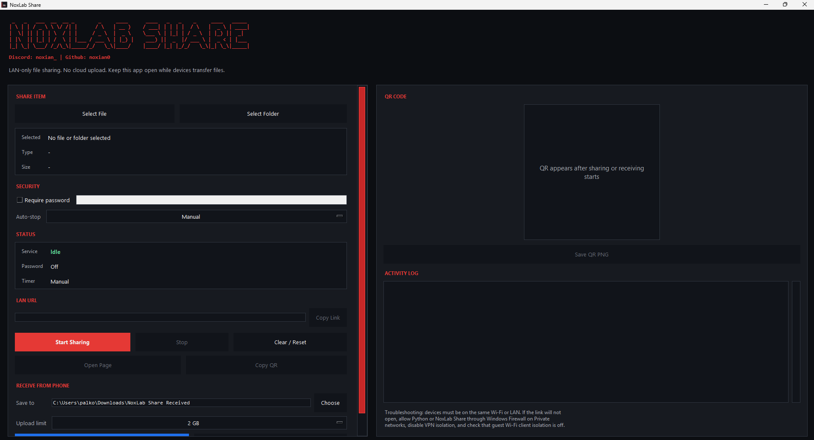
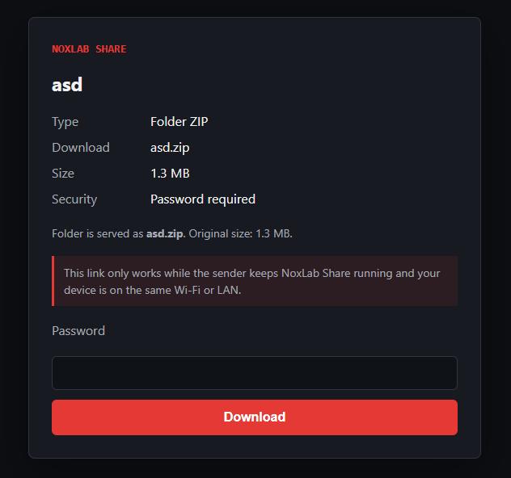

# NoxLab Share

NoxLab Share is a Windows desktop/local utility for sending files from a PC to devices on the same Wi-Fi or LAN, and receiving files from a phone back to the PC. It starts a temporary local web server, shows a LAN link, and generates a QR code.

No cloud upload. No account system. No tunneling service.

## Screenshots





## Features

- Select one file or one folder
- Folder sharing creates a temporary ZIP automatically
- Local HTTP server binds to the LAN, not just localhost
- Automatic port conflict handling
- LAN URL such as `http://192.168.x.x:8765/download`
- QR code display, link copy, QR save, and QR copy on Windows
- Optional password protection
- Auto-stop timer: manual, 10, 30, or 60 minutes
- Mobile-friendly download page
- Mobile-safe download URLs with the real filename extension, so Android/iOS browsers keep `.zip` and other extensions
- Receive files from a phone through a LAN upload page
- Choose the PC folder where received files are saved
- Choose a receive upload limit: 512 MB, 2 GB, 5 GB, 10 GB, or no fixed limit
- Lightweight activity log
- Temporary ZIP cleanup when sharing stops or the app exits

## Stack choice

This MVP uses Python because it gives a small, inspectable Windows app without an Electron-sized runtime. Tkinter provides the desktop UI, Python's standard threaded HTTP server handles LAN downloads, `zipfile` packages folders, and `qrcode`/Pillow generates the QR image.

## Requirements

- Windows 10 or newer
- Python 3.11+ recommended

## Run locally

From the project folder:

```powershell
python -m venv .venv
.\.venv\Scripts\Activate.ps1
pip install -r requirements.txt
python -m noxlab_share
```

## Create a Desktop shortcut

After dependencies are installed, run:

```powershell
.\scripts\create_desktop_shortcut.ps1
```

This creates `NoxLab Share.lnk` on your Desktop and `Open NoxLab Share.lnk` inside the project folder. If `dist\NoxLab Share.exe` exists, the shortcuts use the standalone app. Otherwise they fall back to the local `.venv` launcher.

## Send files from PC

1. Choose **Select File** or **Select Folder**.
2. Optionally enable a password.
3. Choose an auto-stop timer or leave it on Manual.
4. Click **Start Sharing**.
5. Open the LAN URL on another device or scan the QR code.
6. Click **Stop** when finished.

## Receive files from phone

1. Choose the receive folder or keep the default `Downloads\NoxLab Share Received`.
2. Optionally enable a password.
3. Choose an auto-stop timer or leave it on Manual.
4. Click **Start Receiving From Phone**.
5. Scan the QR code with the phone.
6. Choose one or more files on the phone upload page.
7. Click **Stop** when finished.

## LAN and firewall notes

The download link is local-network only. Devices must be on the same Wi-Fi or LAN, and the app must stay open while sharing.

If another device cannot open the link:

- Allow Python or the packaged NoxLab Share app through Windows Firewall on Private networks.
- Make sure both devices are on the same network.
- Disable VPN isolation while testing.
- Avoid guest Wi-Fi networks that block device-to-device access.
- Confirm the sender's PC did not switch networks after starting the share.

## Security notes

- NoxLab Share does not upload files to the cloud or internet.
- It does not create an internet tunnel.
- The local server listens on the LAN while sharing is active.
- Password protection is optional but recommended.
- Stop sharing when finished.
- Anyone on the same LAN who has the link, and the password if enabled, can download the shared item.

## Project structure

```text
noxlab_share/
  __main__.py       App entrypoint
  app.py            Tkinter desktop UI
  server.py         Local HTTP server and download page
  qr_tools.py       QR generation and clipboard helpers
  utils.py          LAN IP, ZIP, size, and cleanup utilities
noxlab_share_launcher.py
start_noxlab_share.cmd
assets/
  noxlab_share.ico
pics/
  main.png
  shared.png
scripts/
  create_desktop_shortcut.ps1
  generate_icon.py
  install_noxlab_share.cmd
  install_noxlab_share.ps1
  package_release.ps1
  setup_stub.cs
README.md
requirements.txt
LICENSE
.gitignore
```

## Create a Windows release

Install packaging tools:

```powershell
pip install pyinstaller
```

Build the standalone app, portable ZIP, and setup EXE:

```powershell
.\scripts\package_release.ps1 -Version 0.2.6
```

Outputs:

- `dist\NoxLab Share.exe` standalone app
- `release\NoxLabShare-0.2.6-windows.zip` portable release
- `release\NoxLabShare-0.2.6-Setup.exe` per-user setup installer

The setup installer copies the app to:

```text
%LOCALAPPDATA%\Programs\NoxLab Share
```

It also creates Desktop and Start Menu shortcuts.

## Development notes

The main local validation path is:

1. Start the app with `python -m noxlab_share`.
2. Select a small test file.
3. Start sharing.
4. Open the displayed `/download` URL in a browser on the same PC.
5. Test sending from a phone or another machine on the same LAN.
6. Stop sharing and confirm the app log reports the server stopped.

Folder sharing is validated the same way, except the selected folder is served as a temporary ZIP.
Receive mode can be validated by starting **Start Receiving From Phone**, opening the `/upload` page from a phone, and sending a small test file.

You can also run the server smoke test without opening the desktop UI:

```powershell
python tests\smoke_server.py
```
